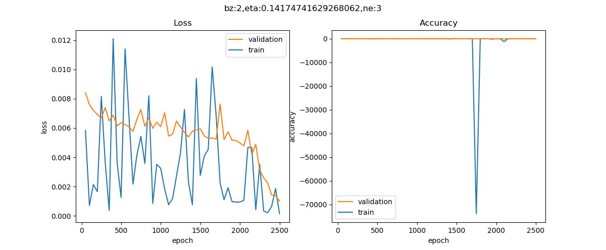
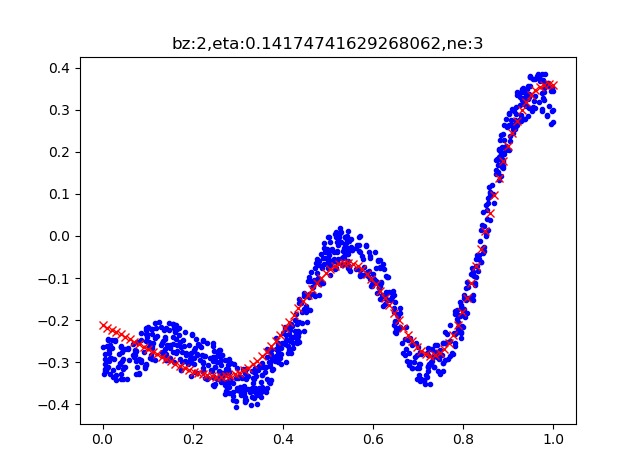

# ai-edu-issue-315

##### 实现随机搜索算法，并应用于该章的复杂（蛇形）曲线拟合中。

对于eta这样的参数，应该是希望的是对数均匀分布的，那么0.001 ~ 0.01,0.01 ~ 0.1, 0.1 ~ 1的抽样概率是类似的，所以使用np中的np.logspace来生成这样的数据。  
而对于batch_size和n_hidden就是用平均分布了。
每一次的值貌似和初始化矩阵有关，每次都不太一样，随机化的次数也是很重要的原因，但是由于花费时间太长我就只跑了40次。以下为一次的结果。
  

  

